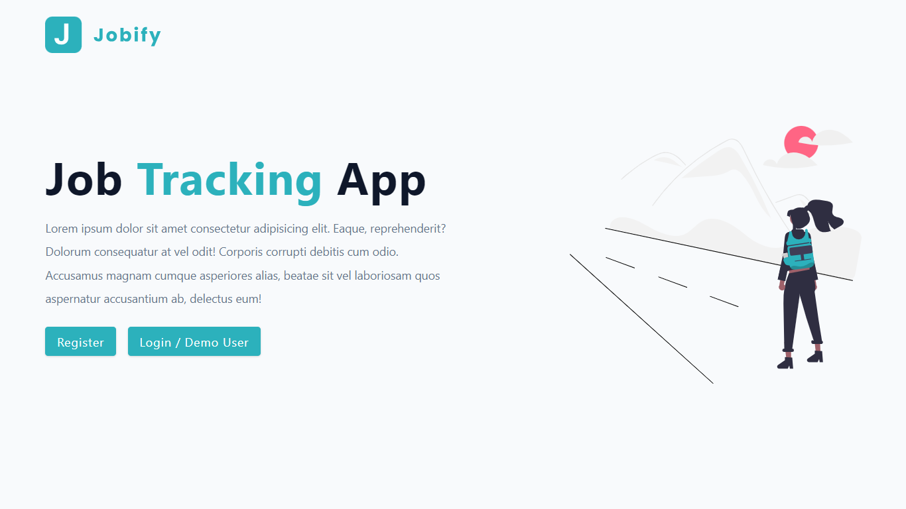
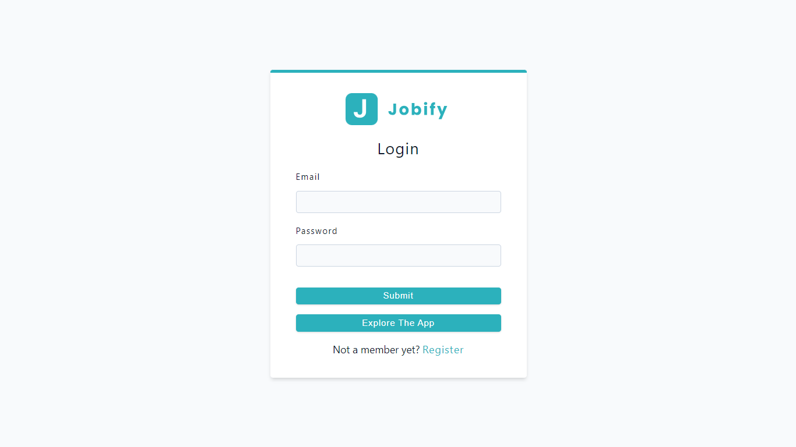
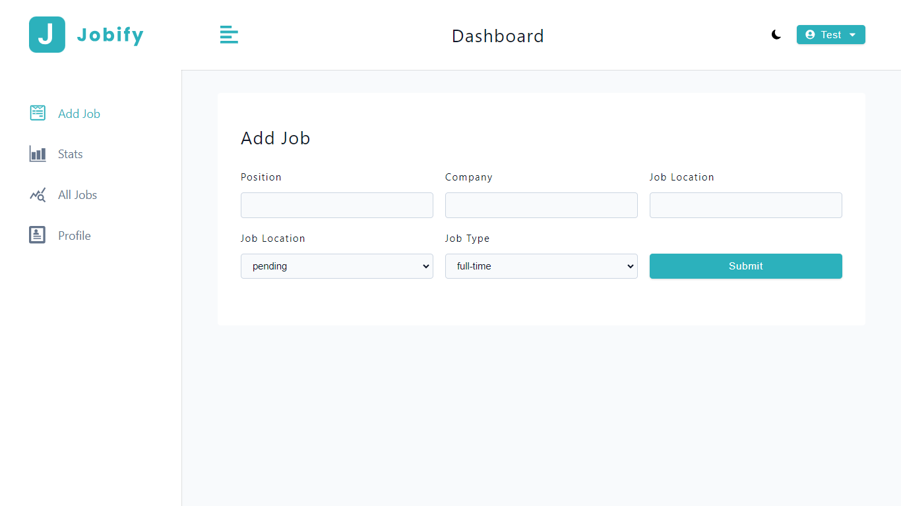
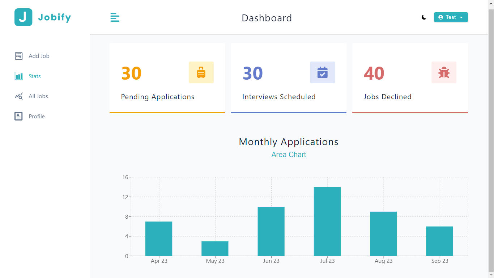
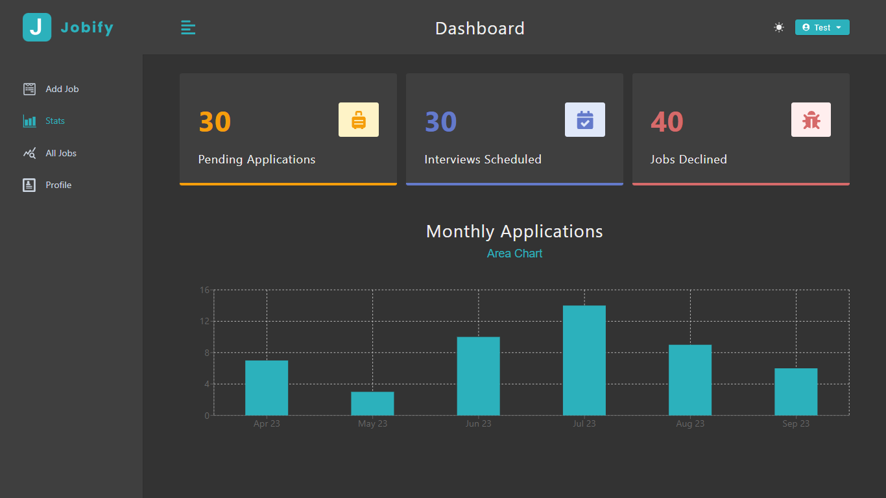
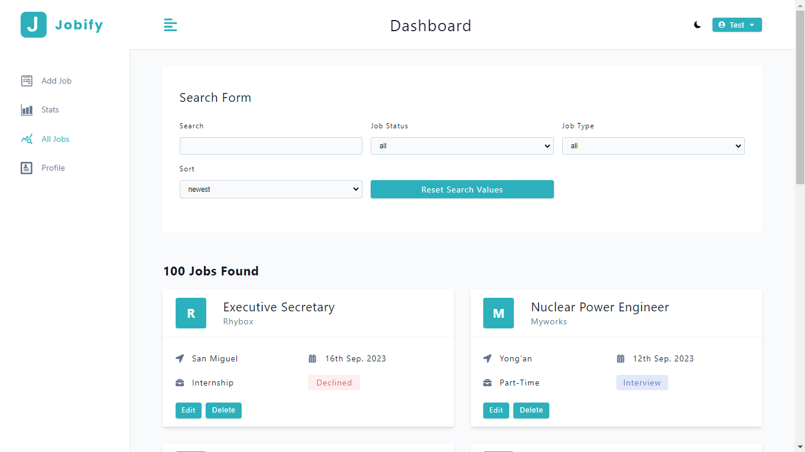
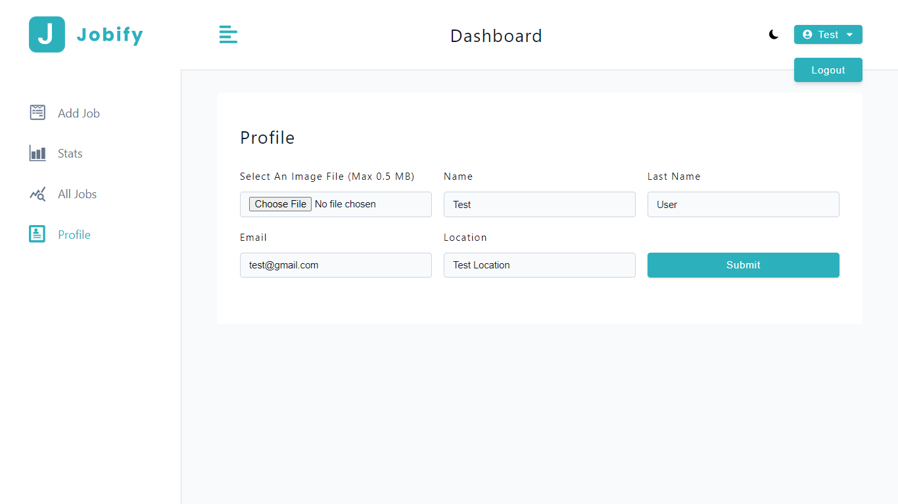

## <h1 align=center>Jobify</h1>

## [Live Link](https://jobify-zdjf.onrender.com/)

- A Full Stack Web Application centered around personal job tracking. On the front end, React and React Query provide a user-friendly interface for adding and managing job application details, including roles, job locations, work modes, and application statuses. The backend employs Node.js and Express.js with MongoDB for efficient data storage.

